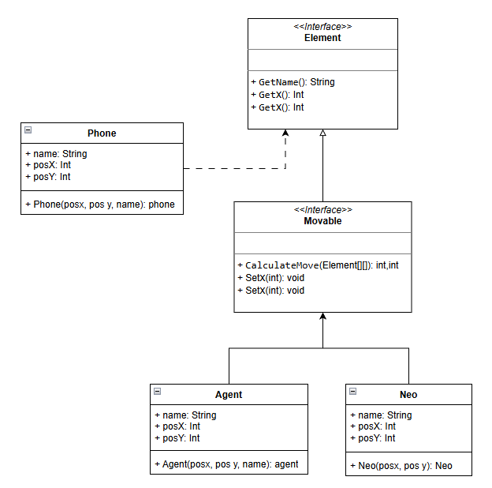

# ╰┈➤ - [ 🌱 ] |  MatrixGame┆⤿🌿⌗

## ▸ 📖 Descripción del juego

MatrixGame se desarrolla en un tablero definido al inicio de cada partida.  
El jugador configura la cantidad de **agentes** y **teléfonos**, así como la posición inicial de **Neo**, de cada agente y de cada teléfono.

- **Objetivo de Neo:** acercarse a un teléfono y escapar de la matriz.
- **Objetivo de los agentes:** impedir la huida y capturar a Neo.

El juego se desarrolla por turnos, generando una dinámica estratégica entre persecución y escape.

---

## ▸ 🎯 Objetivo del proyecto

Implementar una solución concurrente para el juego utilizando **hilos**.  
Cada jugador activo (Neo o los agentes) debe tomar decisiones de manera paralela, reforzando así el aprendizaje y la comprensión sobre la programación concurrente.

---

## ▸ ⚙️ Solución implementada

La solución se divide en dos fases principales que trabajan de forma complementaria:

### Fase 1: Decisión de movimientos
En cada ronda, todos los jugadores calculan sus movimientos de manera concurrente. Para lograrlo, se utiliza una **barrera de sincronización (WaitGroup)** que espera a que todos los hilos terminen de decidir. Cada jugador, al finalizar su decisión, notifica a la barrera, asegurando que ningún movimiento se aplique antes de que todos hayan concluido. Este mecanismo garantiza que las decisiones se tomen en paralelo pero se coordinen de forma ordenada.

### Fase 2: Aplicación de movimientos en el tablero
Una vez que todos los jugadores han decidido, los movimientos se recopilan en una lista que se pasa a la función encargada de actualizar el tablero. De esta manera, cada turno se ejecuta con información **actual** y no con datos futuros, lo que asegura coherencia en la simulación. Así, el juego avanza ronda tras ronda, permitiendo que Neo y los agentes actúen con base en el estado real del tablero en cada momento.

---

## ▸ 🔗 Relación entre elementos

La interacción entre Neo, los agentes y los teléfonos se organiza según el siguiente diagrama:

